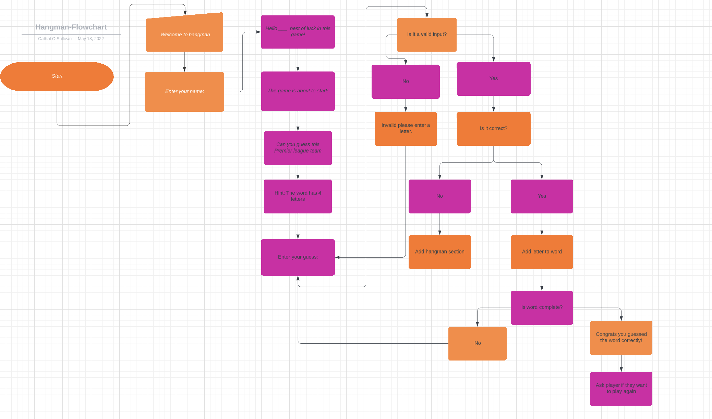
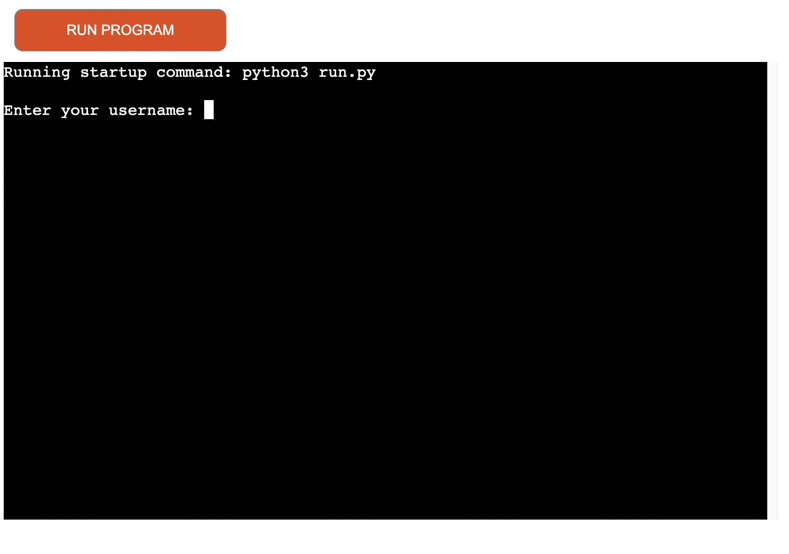
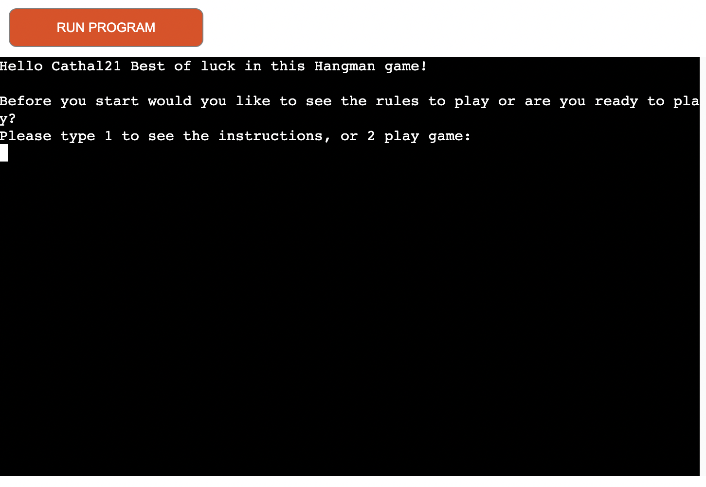
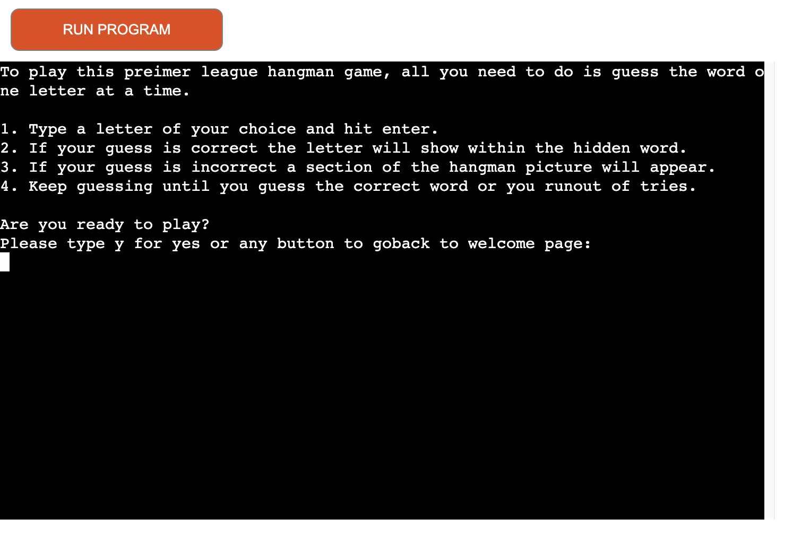
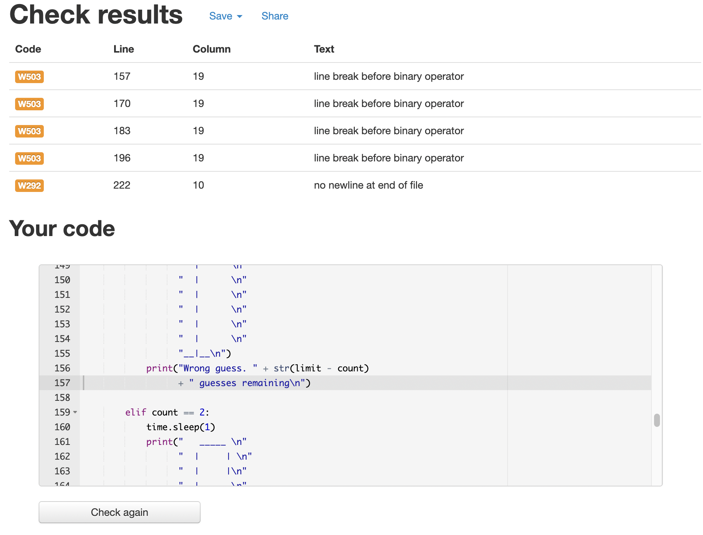
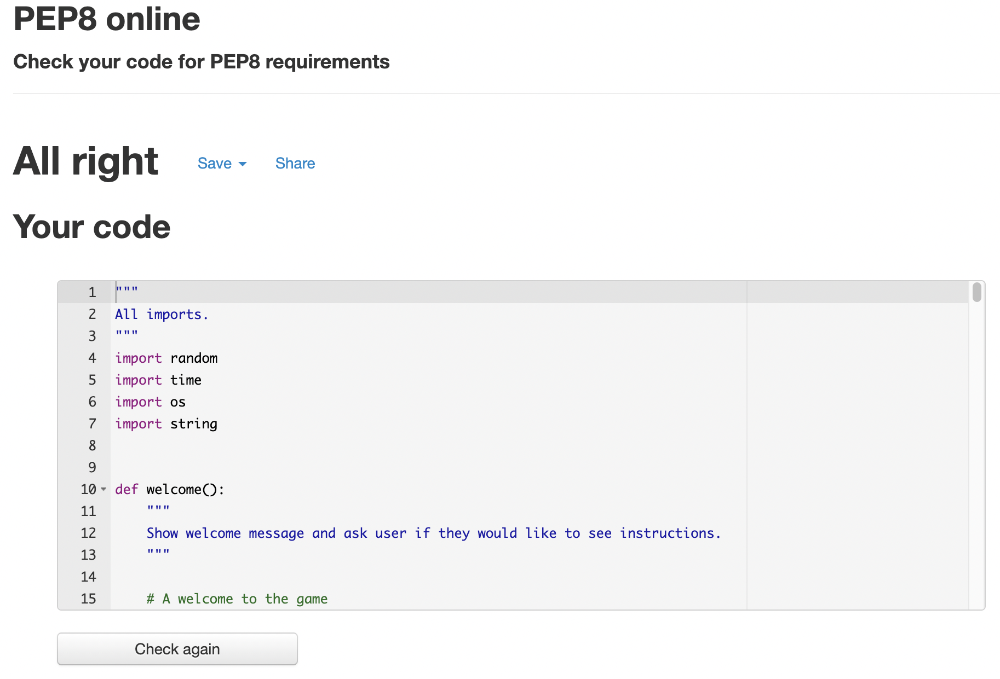

# Premier League Hangman

Hangman is a game for two in which one player tries to guess the letters of a word, the other player recording failed attempts by drawing a gallows and someone hanging on it, line by line.
For this project I wanted to create a version of this game that you can play against the computer rather than playing against another person.
The way this game plays will tell you how many tries you have and how many letters you have to guess.
You win by guessing the word that the computer has chosen for you in that game.

[Click here to go to the live website!](https://premier-league-hangman.herokuapp.com/)

## Table of contents

1. [Plans and structure](#plans-and-structure)
    - [Objectives](#objectives)
2. [Features](#features)
    - [User name](#username)
    - [Welcome page](#welcome-page)
    - [Instructions](#instructions)
    - [Game](#game)
    - [Losing message](#losing-message)   
    - [Winning message](#winning-message) 
    - [Clear terminal](#clear-terminal)
3. [Testing](#testing)
    - [Python](#python)
4. [Deployment](#deployment)

## Plans and structure 

### Objectives
- I wanted to create a game that was easy to navigate.
- I achevied this by using simple yes and no options and 1 and 2 options.

- I wanted to create a game that was easy and had a smooth loop.
- I achevied this when a player wins or looses the game they will be asked if they want to play again or not. If the user says no they will recive a message saying thanks for playing and if they say yes the game will start again.

- Is it clear to know how many tries is there remaining.
- This is done when the user gets a guess wrong the remaining attempts are printed out each round if they get the answer right or wrong it will print out the traditional hangman image that shows how many tries the user has left in the game.

## Features 

### Username
- This is the first page you see when the app loads. You will be asked to enter your username.

### Welcome page
- On this page there is a welcome message and a question to the user. The question asks the user if they want to see the instructions or if they are happy to go ahead and play without seeing them. 

### Instructions
- The instructions page explains to the user how the game is played and then asks the user if they are ready for the game.

### Game
- When the user starts the game, it shows the user the length of the word they are guessing and asks the user to enter a letter.

- While the user is playing the game page also shows other things such as if their last guess was valid, correct, or incorrect, how many tries the user has left, what letters the user has used so far and the letters guessed correctly in their positions within the word. 

### Clear terminal
- Between each page or turn in the game I have cleared the terminal to make it clearer for the user to read. 

## Testing

### Python
Python was tested using PEP8 [PEP8 validator](http://pep8online.com/) 

The Python results came back with the following:

- I fixed all them problems here:

 ## Deployment 

- Deployment steps on Heroku. 

- Set up a Heroku account (if needed)

- In the top right corner of the dashboard, click "New" and choose "Create new app."

- The name of your application must be unique. Click "Create App" after selecting your region.

- Click the "Settings" tab and scroll down to "Config Vars" on your project page.

- Enter "PORT" in the KEY input field, followed by "8000" in the VALUE input field and Add the Config Vars by clicking the "Add" button.

- Add the Python and Node.js buildpacks to the buildpacks section, ensuring that the Python builds are listed above the Node.js builds.

- Go back to the tabs at the top of the page, then select the "Deploy" tab and choose Github deployment.

- Then click the "Connect" button to link your repository.

- Select either Automatic Deployment or Manual Deployment at the bottom of the page. Whenever a project is pushed to Github, Automatic Deployment will deploy it to Heroku. Wait for your project to be deployed.